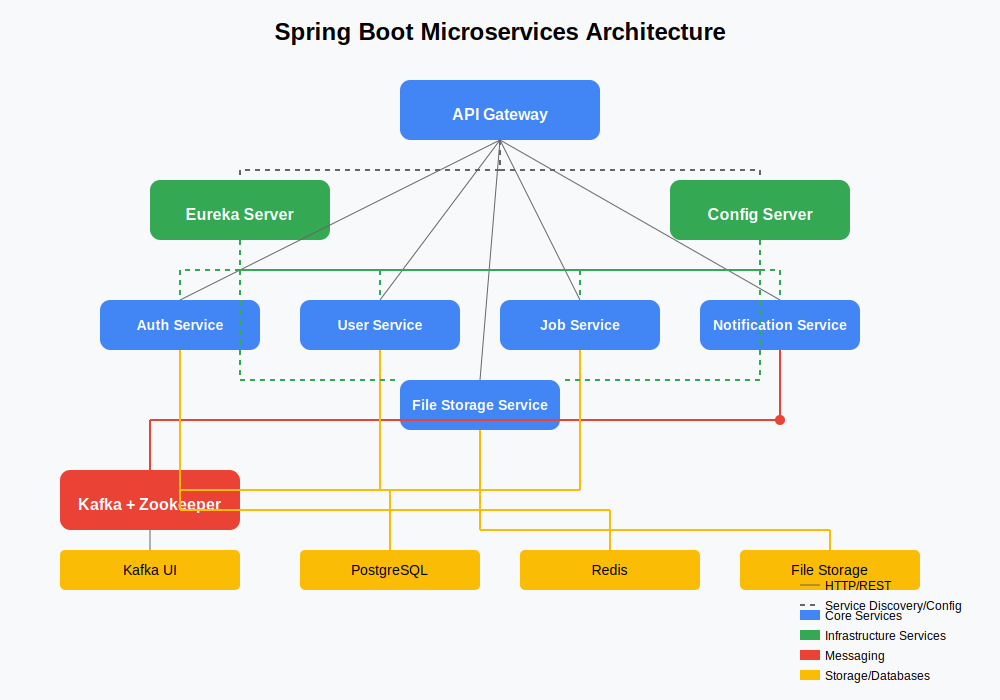

# Spring Boot Microservices Project

A comprehensive Spring Boot microservices architecture with API Gateway, Eureka, Config Server, Kafka messaging, and more.



*You can view the full-size architecture diagram [here](docs/images/architecture-diagram.svg)*

## Project Overview

This project demonstrates a complete microservices ecosystem built with Spring Boot and Spring Cloud. It includes authentication, user management, job services, notifications, and file storage, all communicating through REST APIs and asynchronous messaging.

## Features

- **API Gateway**: Single entry point for all client requests
- **Service Discovery**: Automatic service registration and discovery with Eureka Server
- **Centralized Configuration**: Externalized configuration with Config Server
- **Authentication & Authorization**: Secure services with JWT tokens and role-based security
- **Event-Driven Architecture**: Asynchronous communication via Kafka
- **Monitoring**: Kafka UI for message visualization
- **Storage Solutions**: PostgreSQL for relational data, Redis for caching, file storage for documents

## Services

### Infrastructure Services

- **Config Server**: Centralizes configuration for all services
- **Eureka Server**: Enables service discovery and registration
- **API Gateway**: Routes requests to appropriate services

### Core Microservices

- **Auth Service**: Handles user registration and authentication
- **User Service**: Manages user profiles and details
- **Job Service**: Manages job categories, offers, and applications
- **Notification Service**: Processes and delivers user notifications
- **File Storage Service**: Handles file uploading, storage, and retrieval

### Supporting Infrastructure

- **Kafka & Zookeeper**: Messaging platform for asynchronous communication
- **PostgreSQL**: Relational database for structured data
- **Redis**: In-memory data store for caching
- **Kafka UI**: Web interface to monitor Kafka topics and messages

## Getting Started

### Prerequisites

- Java 11 or higher
- Docker and Docker Compose
- Maven

### Installation

1. Clone the repository
   ```bash
   git clone https://github.com/devxsb/spring-boot-microservices.git
   cd spring-boot-microservices
   ```

2. Start the infrastructure with Docker Compose
   ```bash
   docker-compose up
   ```

3. Start the services in the following order:
   - Eureka Server
   - API Gateway
   - Config Server
   - Auth Service
   - User Service
   - Job Service
   - Notification Service
   - File Storage Service

### Running Each Service

Navigate to each service directory and run:

```bash
mvn spring-boot:run
```

## API Documentation

Swagger UI is available for each service at:
```
http://localhost:8080/v1/{service-name}/swagger-ui/index.html
```

### Key Endpoints

#### Auth Service
- `POST /v1/auth/register` - Register a new user
- `POST /v1/auth/login` - Authenticate and get JWT token

#### User Service
- `PUT /v1/user/update` - Update user profile information

#### Job Service
- `POST /v1/job-service/category/create` - Create a new job category (Admin only)
- `POST /v1/job-service/offer/create` - Create a new job offer
- `GET /v1/job-service/offer/getAllOffers` - Get all job offers
- `DELETE /v1/job-service/offer/deleteOfferById/{id}` - Delete a job offer

#### Notification Service
- `GET /v1/notification/getAllByUserId/{id}` - Get all notifications for a user

#### File Storage Service
- `GET /v1/file-storage/download/{id}` - Download a file by ID

## Authentication

The system uses JWT tokens for authentication:

1. Register a user or login to get a JWT token
2. Include the token in the Authorization header for subsequent requests:
   ```
   Bearer {your-jwt-token}
   ```

## Event Flow

Services communicate asynchronously through Kafka for various events:

1. User Service publishes user-related events (registration, profile updates)
2. Job Service publishes job-related events (new job offers, applications)
3. Notification Service consumes these events to create notifications for users

## Monitoring

- **Eureka Dashboard**: http://localhost:8761
- **Kafka UI**: http://localhost:9090

## Technologies

- **Spring Boot**: Microservices framework
- **Spring Cloud**: Distributed system tools
- **Spring Security**: Authentication and authorization
- **Spring Data JPA**: Database access
- **Spring Cloud Gateway**: API Gateway
- **Netflix Eureka**: Service discovery
- **Spring Cloud Config**: Centralized configuration
- **Apache Kafka**: Messaging platform
- **PostgreSQL**: Relational database
- **Redis**: In-memory data store
- **Docker**: Containerization
- **Swagger/OpenAPI**: API documentation

## Project Structure

```
spring-boot-microservices/
├── api-gateway/              # API Gateway service
├── config-server/            # Configuration server
├── eureka-server/            # Service discovery server
├── auth-service/             # Authentication service
├── user-service/             # User management service
├── job-service/              # Job management service
├── notification-service/     # Notification handling service
├── file-storage/             # File storage service
└── docker-compose.yml        # Docker configuration
```

## Development

### Adding a New Service

1. Create a new Spring Boot application
2. Add Eureka Client and Config Client dependencies
3. Configure the application to register with Eureka
4. Configure the application to use Config Server
5. Add the necessary dependencies (JPA, Kafka, etc.)
6. Implement the service logic
7. Add the service to API Gateway configuration

### Messaging

To publish events to Kafka:

```java
@Autowired
private KafkaTemplate<String, EventMessage> kafkaTemplate;

public void publishEvent(EventMessage event) {
    kafkaTemplate.send("topic-name", event);
}
```

To consume events from Kafka:

```java
@KafkaListener(topics = "topic-name", groupId = "group-id")
public void consumeEvent(EventMessage event) {
    // Process the event
}
```

## Contributing

1. Fork the repository
2. Create a feature branch (`git checkout -b feature/amazing-feature`)
3. Commit your changes (`git commit -m 'Add some amazing feature'`)
4. Push to the branch (`git push origin feature/amazing-feature`)
5. Open a Pull Request

## License

This project is licensed under the MIT License - see the LICENSE file for details.

## Acknowledgments

- Spring Boot and Spring Cloud teams
- Apache Kafka project
- Docker and all other open-source technologies used